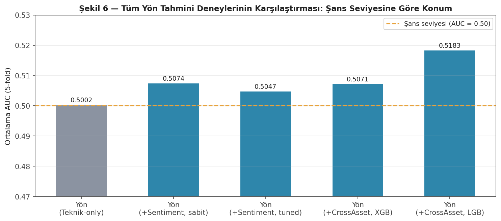

# Stock Direction & Volatility Prediction with AI Agent

A machine learning system that predicts next-day stock price direction and forward volatility, enriched with LLM-generated news sentiment and cross-asset market features via a tool-calling agent. Built with a strong focus on data leakage prevention and honest, statistically-grounded reporting — walk-forward validation, nested hyperparameter tuning, look-ahead bias testing, and a live prospective test running against the backtest.

## Key finding (read this first)

After testing news sentiment, cross-asset market features, and feature ablation across two model families (XGBoost, LightGBM) with nested walk-forward tuning and pre-registered significance thresholds (+0.02 AUC, p<0.05), **no feature addition produced a statistically robust improvement over the technical-indicator baseline** (AUC ≈ 0.50–0.52 across all configurations — near chance level for 1-day direction prediction). An initial "significant" sentiment result (p=0.0024, fixed hyperparameters) did not replicate under nested tuning (p=0.33), illustrating exactly the kind of false-positive risk this project's methodology was designed to catch.



*All experiments (technical-only, +sentiment, +cross-asset) cluster near AUC 0.50. See `reports/Proje_Sunum_Raporu_v5_Bulgular.docx` for the full experimental writeup with all figures, tables, and per-fold statistics.*

This isn't a negative result to hide — it's the point. Most "AI beats the market" claims skip exactly the validation steps (nested tuning, pre-committed significance thresholds, prospective testing) that would have caught this. The value of this project is the *methodology*, and the system is designed around that honesty: the web app never claims a reliable trading edge, and it says so explicitly, every time.

## Overview

The system combines three signal sources:
- **Technical indicators** (RSI, MACD, Bollinger Bands, ATR, ADX, OBV) computed from OHLCV data via `pandas-ta`
- **News sentiment**, generated by an LLM agent (Gemini, with a local Ollama fallback for quota resilience) from real financial news (FNSPID historical + Alpha Vantage + Finnhub live), converted into structured numeric features (`sentiment_score`, `sentiment_confidence`, `sentiment_std`, `sentiment_ema`, `sentiment_momentum`)
- **Cross-asset / market-wide features** (VIX, SPY, QQQ, sector ETFs, dollar index, 10-year yield) — evaluated but *not* included in the production model, since they did not clear the pre-registered significance bar

Two separate models are trained on the combined feature set:
- **Direction model** (binary classification): will the stock rise or fall next day?
- **Volatility model** (regression): what will realized volatility look like over the next 5 days?

A daily agent pipeline (`write_report.py`) turns live technical + sentiment data and the trained models' predictions into a plain-language report, and a Streamlit web app ("Sinyal Sisi") presents it — always alongside the model's real, measured historical AUC/RMSE, not an invented confidence claim.

## Why this project is methodologically careful

Financial time-series ML is notoriously easy to get wrong via data leakage and overclaiming. This project treats both as first-class concerns:

- **Chronological, walk-forward (expanding window) cross-validation** — never random split
- **Nested hyperparameter tuning** — Optuna search is confined to the training portion of each outer fold, so tuning itself cannot leak future information into the test score
- **Pre-registered significance thresholds** — before any feature-addition experiment, a bar (+0.02 AUC or equivalent, p<0.05 via paired t-test across folds) was fixed in advance and never relaxed after seeing results, including when a promising-looking result (cross-asset features, LightGBM) weakened under a follow-up robustness check
- **Look-ahead bias testing** — automated test (`tests/test_no_lookahead.py`) verifying indicators only use data available up to time *t*
- **Naive baseline comparisons** — every model result is compared against a trivial baseline (e.g. "repeat yesterday's volatility") to confirm it actually adds value
- **Cross-sectional (not cross-day) sentiment batching** — the agent batches same-day, multi-ticker news into a single LLM call, but never batches across different days, specifically to prevent in-context temporal leakage (the model seeing a later day's news while scoring an earlier one)
- **Backtest vs. prospective test separation** — historical sentiment backtesting is kept strictly separate from a live, daily-logged prospective test (`agent/log_daily_prediction.py` + `agent/update_actuals.py`, scheduled via Task Scheduler), specifically to detect LLM knowledge-cutoff leakage and confirm the backtest AUC isn't an artifact
- **Point-in-time consistency in production**: the live agent anchors both the technical snapshot and the sentiment lookback window to the *same* reference date, rather than independently to "now," to avoid mixing information from different points in time within a single report
- **Explicit target masking** — silent `NaN > x → False` bugs (a classic pandas footgun) are guarded against when generating labels
- **Structured-output content validation** — JSON schema conformance was found to guarantee shape but not content quality (e.g. a local LLM producing valid-but-degenerate `score=0, confidence=0` output, or scores on the wrong numeric scale); both are explicitly detected and rejected before being written to the dataset

## Tech Stack

| Layer | Tool |
|---|---|
| Market data | `yfinance` |
| Technical indicators | `pandas-ta` |
| ML models | `xgboost`, `lightgbm`, walk-forward CV, Optuna (nested tuning) |
| Sentiment LLM | Google Gemini API (`google-genai`, primary) + Ollama `llama3.2:3b` (local fallback when quota is exhausted) |
| Historical news (backtest) | [FNSPID](https://huggingface.co/datasets/Zihan1004/FNSPID) dataset + Alpha Vantage News & Sentiment API (fills the FNSPID → present gap) |
| Live news (prospective) | Finnhub API |
| Cross-asset data | `yfinance` (VIX, SPY, QQQ, sector ETFs, UUP, 10Y yield) |
| Web app | Streamlit + Plotly (candlestick/RSI charts, custom gauge visualizing model uncertainty) |
| Config management | Single YAML source of truth (`config/config.yaml`) — no hardcoded parameters |

## Project Structure
```bash
├── data/
│ ├── raw / processed              # main technical + combined dataset (2020–present)
│ ├── raw_sentiment_backtest/
│ └── processed_sentiment_backtest/ # sentiment scores, FNSPID window through 2024-12-31
├── features/
│ ├── fetch_data.py, clean_data.py, indicators.py, targets.py, finalize_dataset.py
│ ├── fnspid_filtering.py, prepare_sentiment_backtest_dataset.py
│ ├── fetch_alphavantage_news.py    # resumable, idempotent AV backfill
│ ├── fetch_cross_asset.py          # VIX/SPY/QQQ/sector/macro feature builder
│ ├── add_sentiment_features.py     # sentiment_ema / sentiment_momentum + merge into technical dataset
│ └── drop_sentiment.py             # post-hoc sentiment quality cleanup
├── agent/
│ ├── fetch_news.py                 # Finnhub live news
│ ├── generate_sentiment.py         # Gemini, cross-sectional (same-day, multi-ticker) batching
│ ├── generate_sentiment_ollama.py  # local fallback, single-ticker requests, degenerate-output rejection
│ ├── live_data_fetch.py            # live technical + sentiment fetch, anchored to a single reference date
│ ├── write_report.py               # daily LLM report generation, grounded in real measured model performance
│ ├── log_daily_prediction.py       # prospective test: logs today's prediction
│ └── update_actuals.py             # prospective test: fills in what actually happened
├── models/
│ ├── walk_forward.py               # expanding-window CV split generator
│ ├── train_direction_baseline.py / train_direction_lightgbm.py / train_volatility_baseline.py
│ ├── tuning.py                     # nested walk-forward Optuna tuning (shared by direction & volatility)
│ ├── train_direction_tuned.py / train_volatility_tuned.py
│ ├── feature_ablation.py           # gain-importance-ranked feature-family ablation
│ ├── feature_importance_volatility.py
│ ├── train_final_model.py          # trains & saves production .pkl models + performance summary JSON
│ └── evaluate_and_plot.py
├── app/
│ ├── app.py                        # Streamlit app ("Sinyal Sisi") — report generation + charts
│ └── ticker_panel.py               # market overview board, per-ticker daily-change panel
├── tests/
│ ├── test_no_lookahead.py, audit_coverage.py, save_graphic.py
├── config/
│ ├── config.yaml
│ └── loader.py
└── reports/                        # generated evaluation plots + full findings report (.docx)
```

## Key Design Decisions

- **Universe**: 11 large-cap tickers spanning tech, finance, energy, healthcare, and consumer sectors (GOOGL, NVDA, INTC, ORCL, JPM, TSLA, OXY, GILD, HD, AXP, AVGO); TSLA is technical-only (excluded from the sentiment backtest subset)
- **Pooled modeling**: a single model is trained across all tickers (with ticker as a categorical feature) rather than per-ticker models, to maximize training data
- **Sentiment coverage**: FNSPID (2018-10 → 2020-06) + Alpha Vantage backfill (→ 2024-12-31), merged and deduplicated; the merge/backfill scripts are resumable and idempotent, since both external APIs are rate-limited
- **Structured LLM output**: the agent never returns free text for sentiment — always a fixed JSON schema (`score`, `confidence`, `reasoning`, per-article breakdown). Schema conformance was found *not* to guarantee numeric-range or content validity on its own, especially with the local fallback model, so both are separately validated in code
- **Feature selection discipline**: cross-asset features were evaluated with the same nested-tuning protocol as sentiment and did not clear the pre-registered bar; they are documented as a negative result and excluded from the production model rather than included on the strength of a single favorable-looking run
- **Production model**: technical + sentiment (33 features), XGBoost, nested-tuned on the full history, saved as `.pkl` alongside a `model_performance_summary.json` that the reporting agent is required to read rather than guess at

## Current Status

- [x] Data pipeline: fetch → clean → technical indicators → targets → leakage-tested
- [x] Baseline & nested-tuned models: XGBoost & LightGBM for direction and volatility, walk-forward validated, naive-baseline compared
- [x] Sentiment generation: Gemini (primary) + Ollama (local fallback) agent, cross-sectional batching, structured-output validation, resumable across both LLM providers and both news sources (FNSPID + Alpha Vantage)
- [x] Combined technical + sentiment model retraining, evaluated against technical-only baseline with paired significance testing
- [x] Cross-asset feature evaluation (VIX/SPY/QQQ/sector/macro) — tested, found not significant, documented and excluded from production
- [x] Feature-family ablation analysis (gain-importance-ranked)
- [x] Production models trained and saved (`final_direction_model.pkl`, `final_volatility_model.pkl`) with a real-performance JSON for the reporting agent
- [x] Web app: daily prediction + agent-generated rationale, with a persistent model-reliability banner and an uncertainty-visualizing confidence gauge
- [x] Prospective (live) testing infrastructure: daily automated logging (Task Scheduler, 09:15 local) + actuals backfill — **currently accumulating data**
- [ ] Prospective test results written up and compared against backtest AUC (pending sufficient sample size)

## Setup

```bash
python -m venv .venv
source .venv/bin/activate      # Windows: .venv\Scripts\activate
pip install -r requirements.txt
cp .env.example .env           # then fill in GOOGLE_API_KEY, FINNHUB_API_KEY, ALPHAVANTAGE_API_KEY
python config/loader.py        # sanity check
```

Run the web app:
```bash
streamlit run app/app.py
```

Full experimental writeup (all figures, per-fold statistics, methodology): `reports/Proje_Sunum_Raporu_v5_Bulgular.docx`
